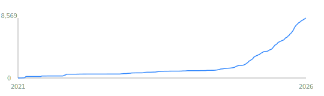
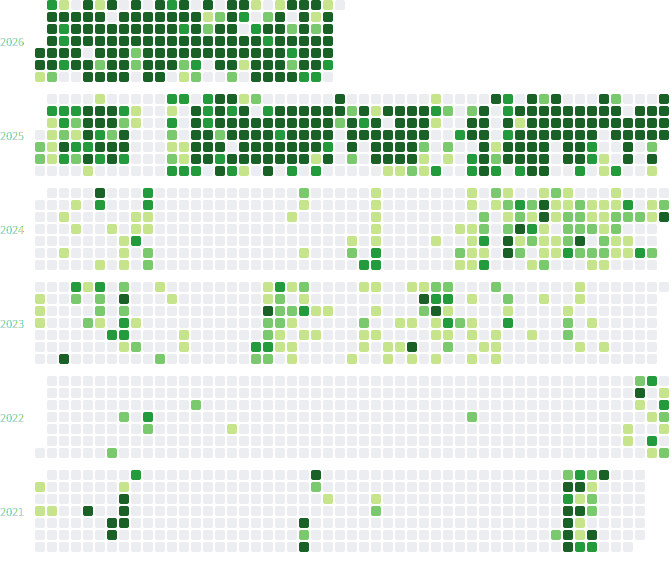

# Hi there, I'm Pragash Mohanarajah 👋

### Full-Stack Engineer & AI Researcher
Building high-performance systems at the intersection of **Deep Learning**, **Scalable Web Architecture**, and **Product Design**.

---

## ⚡ Quick Bio

I architect intelligent web applications that bridge the gap between complex data and intuitive user experiences. My work ranges from restoring ancient history through Multi-modal Vision-Language (VL) OCR to building real-time FinTech pipelines. I specialize in end-to-end systems that combine deep learning research with scalable cloud architecture.

* **🔭 Current Focus:** Multi-modal VL OCR for ancient text restoration, Scalable Data Pipelines & Optimizing Chess Engine intuition models.
* **🌱 Learning:** Advanced ONNX optimization, AWS Lambda for inference scaling, and fine-tuning Vision-Language Models (VLMs).
* **💬 Ask me about:** Next.js, PyTorch, Chess theory, or litigation funding systems.

---

## 🛠 Tech Stack

| Category | Tools & Technologies |
| :--- | :--- |
| **UI & Styling** | Tailwind CSS, HeroUI, Shadcn UI, Lucide React, Framer Motion |
| **Frontend** | Next.js, React, TypeScript, PHP |
| **Backend** | Node.js, Flask (Python), NGINX, Laravel |
| **Databases** | PostgreSQL, MongoDB, Supabase |
| **AI / Data** | PyTorch, ONNX, Deep Learning (NLP/CV), Matlab, Data Ingestion Pipelines |
| **Systems & Hardware** | C, C++, VHDL, Arduino, Raspberry Pi |
| **DevOps** | AWS (S3/EC2), Vercel, Docker Compose, GitHub Actions |

---

## 🚀 Key Research & Projects

### 🧠 AI & Deep Learning
* **Ancient Text Restoration (UATRIAL):** Developed models using Deep Learning to restore and attribute ancient epigraphy, merging history with state-of-the-art NLP.
* **Neural Chess Engines:** Training models on FEN/PGN datasets to predict moves, served via Flask APIs to custom Next.js frontends. Experimenting with Stockfish fine-tuning and custom evaluation functions.
* **AI File Converter:** Built an end-to-end application that converts various file formats into standardized PDFs, enabling seamless RAG-based inference for AI models.

### 💸 FinTech & Systems Engineering
* **AxiaFunder:** Architected real-time investment dashboards and robust CSV ingestion pipelines for litigation funding using Node.js and PostgreSQL.
* **Hack Cambridge:** Maintained critical administration platforms for one of the UK’s premier hackathons.

### 📊 Data Infrastructure
* **End-to-End Pipelines:** Specialized in "Browser → Cloud Storage → Background Worker → Database" workflows for high-frequency data processing.

---

## 💡 Engineering Philosophy

> *"Build systems that are interactive, intelligent, and scalable. Prioritize clean architecture over quick hacks, and use AI to simplify — not complicate — the user experience."*

---

## 🤝 Let's Connect

I’m always open to collaborating on intelligent systems, web platforms, or anything chess-related.

* 🌍 **Portfolio:** [Visit my site](https://portfolio-pragash-mohanarajahs-projects.vercel.app/)
* 💼 **LinkedIn:** [linkedin.com/in/pragash-mohanarajah](https://www.linkedin.com/in/pragash-mohanarajah/)

---

<!-- DEV_METRICS_START -->
## 📊 Development Metrics

### 🐱 GitHub Overview
- 🔥 Current Streak: 3 days
- 🏆 Longest Streak: 26 days
- ✨ Total Commits: 5,009
- 💖 Commit Breakdown: 516 public (10.3%), 4,493 private (89.7%) · 1,990 owned (39.7%), 3,019 contributed (60.3%)
- 🚀 Repositories: 82 (35 public (42.7%), 47 private (57.3%))
- 👤 Ownership: 77 owned (93.9%), 5 contributed-to (6.1%)
- ⭐ Stars: 100,058 · 👀 Watchers: 694 · 🍴 Forks: 11,970 · 🗄️ Archived: 19
- 🧠 Estimated Lines of Code: 2,322,339
- 🤝 Followers: 1 · Following: 11
- 📅 Account age: 1,905 days

### 📝 Lines of Code by Language
```
C                    ███████                    29.02% (673,946 LOC)
TypeScript           ███████                    26.78% (621,926 LOC)
Jupyter Notebook     ██                          9.31% (216,134 LOC)
MDX                  ██                          8.16% (189,522 LOC)
Python               ██                          7.02% (163,062 LOC)
HTML                 █                           4.90% (113,758 LOC)
JavaScript           █                           4.40% (102,144 LOC)
Makefile             █                           2.68% (62,186 LOC)
```

### 📚 Top Languages (by Repo Count)
```
JavaScript           ████                       16.67% (36 repos)
Python               ████                       14.35% (31 repos)
CSS                  ███                        12.96% (28 repos)
TypeScript           ██                          9.72% (21 repos)
HTML                 ██                          9.26% (20 repos)
Shell                ██                          6.94% (15 repos)
Jupyter Notebook     █                           5.09% (11 repos)
Dockerfile           █                           3.70% (8 repos)
```

### 💾 Languages by Code Size (Bytes)
```
C                    ███████                    29.02% (33,697,286 bytes)
TypeScript           ███████                    26.78% (31,096,322 bytes)
Jupyter Notebook     ██                          9.31% (10,806,681 bytes)
MDX                  ██                          8.16% (9,476,115 bytes)
Python               ██                          7.02% (8,153,013 bytes)
HTML                 █                           4.90% (5,687,882 bytes)
```

### 🧩 Project Categories (by Repo Count)
```
Other                ████████████████           65.85% (54 repos)
AI / ML              █████                      18.29% (15 repos)
Web Apps             ██                          9.76% (8 repos)
Data Systems         ██                          6.10% (5 repos)
```

### 🧮 Project Categories (by Estimated LOC)
```
AI / ML              ████████████████████       78.09% (1,813,621 LOC)
Other                █████                      19.85% (460,954 LOC)
Data Systems                                     1.47% (34,226 LOC)
Web Apps                                         0.58% (13,538 LOC)
```

### 🏷️ Top Topics
```
JavaScript           ███████████                43.90% (36 repos)
Python               █████████                  37.80% (31 repos)
CSS                  █████████                  34.15% (28 repos)
TypeScript           ██████                     25.61% (21 repos)
HTML                 ██████                     24.39% (20 repos)
Shell                █████                      18.29% (15 repos)
Jupyter Notebook     ███                        13.41% (11 repos)
Dockerfile           ██                          9.76% (8 repos)
SCSS                 ██                          6.10% (5 repos)
Makefile             ██                          6.10% (5 repos)
```

### 🚀 Top Owned Projects
- Pragash-Mohanarajah/exambank-ai-frontend — Exambank AI - Frontend Code Repository (forked from AlphaFactory/exambank-fro... _(AI / ML · 474 commits · private)_
- Pragash-Mohanarajah/portfolio — Pragash Mohanarajah: Personal Portfolio _(AI / ML · 232 commits · private)_
- IB-Integrated-Design-Project-Group-M202/competition-in-arena — Configures and Operates all of the Components on the Arduino Uno Wi-Fi Rev 2 ... _(Other · 169 commits)_
- Pragash-Mohanarajah/taec-thamilthiren _(Other · 167 commits · private)_
- Pragash-Mohanarajah/taec-thamilthiren-backend _(Other · 156 commits · private)_

### 🤝 Top Contributed Projects
- AxiaFunder/dashboard-axiafunder _(Other · 1936 commits · private)_
- AxiaFunder/axiafunder — Monorepo for Axiafunder Applications _(Other · 1 commits · private)_
- supabase/supabase — The Postgres development platform. Supabase gives you a dedicated Postgres da... _(AI / ML)_

### 📅 Productivity by Time of Day
```
Night (00-06)                                    0.98% (21 commits)
Morning (06-12)      █████████████              52.97% (1,132 commits)
Afternoon (12-18)    ████████                   30.32% (648 commits)
Evening (18-24)      ████                       15.72% (336 commits)
```

### 📅 Productivity by Day
```
Sunday               ██                          9.85% (518 contributions)
Monday               ████                       14.77% (777 contributions)
Tuesday              ████                       17.35% (913 contributions)
Wednesday            █████                      18.29% (962 contributions)
Thursday             ████                       14.81% (779 contributions)
Friday               ████                       16.97% (893 contributions)
Saturday             ██                          7.96% (419 contributions)
```

### 📦 Most Active Repositories
```
AxiaFunder/dashboard-axiafunder                                             ██████████                 38.65% (1,936 commits)
Pragash-Mohanarajah/exambank-ai-frontend                                    ██                          9.46% (474 commits)
Pragash-Mohanarajah/portfolio                                               █                           4.63% (232 commits)
cued-ia-computing/flood-kg487-pm719                                         █                           4.19% (210 commits)
n15hsy/axia-lm-optimizer                                                    █                           3.99% (200 commits)
IB-Integrated-Design-Project-Group-M202/competition-in-arena                █                           3.37% (169 commits)
Pragash-Mohanarajah/taec-thamilthiren                                       █                           3.33% (167 commits)
```

### ⚡ Recent Activity
- AxiaFunder/dashboard-axiafunder — Merge pull request #157 from AxiaFunder/develop
- AxiaFunder/dashboard-axiafunder — fix: removes "to Date" from the graphs specifically when it is the final day of the quarter
- AxiaFunder/dashboard-axiafunder — fix: removes "to Date" from the graphs specifically when it is the final day of the quarter
- AxiaFunder/dashboard-axiafunder — Merge pull request #156 from AxiaFunder/develop
- AxiaFunder/dashboard-axiafunder — chore: improve job status fetching logic to optimise for loading times, applies pagination during initial data fetches
- Pragash-Mohanarajah/axia-lm-optimizer — Merge pull request #52 from Pragash-Mohanarajah:main
- n15hsy/axia-lm-optimizer — Merge pull request #52 from Pragash-Mohanarajah:main
- Pragash-Mohanarajah/axia-lm-optimizer — fix: use file writer.add_page instead of append method to combat malformed metadata and corruption on dictionary level
- n15hsy/axia-lm-optimizer — fix: use file writer.add_page instead of append method to combat malformed metadata and corruption on dictionary level
- Pragash-Mohanarajah/axia-lm-optimizer — Merge pull request #51 from Pragash-Mohanarajah:main
- n15hsy/axia-lm-optimizer — Merge pull request #51 from Pragash-Mohanarajah:main
- Pragash-Mohanarajah/axia-lm-optimizer — fix: locks package versions for future stability, reliability and safety in light of malware attacks
- n15hsy/axia-lm-optimizer — fix: locks package versions for future stability, reliability and safety in light of malware attacks
- Pragash-Mohanarajah/axia-lm-optimizer — fix: install all dependencies for Playwright during initial configuration to simplify process; need Headless Chromium and Serverless Chromium
- n15hsy/axia-lm-optimizer — fix: install all dependencies for Playwright during initial configuration to simplify process; need Headless Chromium and Serverless Chromium

### 🌟 Recent Stars
- n15hsy/axia-lm-optimizer
- koblas/stdnum-js
- pytorch/tutorials

### 📈 All-Time Commit History


### 📅 Contribution Graph


_Last updated on Wed, 01 Apr 2026 16:44:07 GMT_
<!-- DEV_METRICS_END -->
