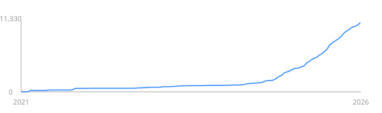
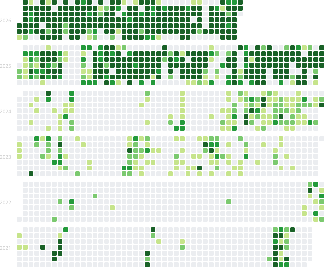

# Hi there, I'm Pragash Mohanarajah 👋

### Full-Stack Engineer & AI Researcher
Building high-performance systems at the intersection of **Deep Learning**, **Scalable Web Architecture**, and **Product Design**.

---

## ⚡ Quick Bio

I architect intelligent web applications that bridge the gap between complex data and intuitive user experiences. My work ranges from restoring ancient history through Multi-modal Vision-Language (VL) OCR to building real-time FinTech pipelines. I specialize in end-to-end systems that combine deep learning research with scalable cloud architecture.

* **🔭 Current Focus:** Multi-modal VL OCR for ancient text restoration, Scalable Data Pipelines & Optimizing Chess Engine intuition models.
* **🌱 Learning:** Advanced ONNX optimization, AWS Lambda for inference scaling, and fine-tuning Vision-Language Models (VLMs).
* **💬 Ask me about:** Next.js, PyTorch, Chess theory, or litigation funding systems.

---

## 🛠 Tech Stack

| Category | Tools & Technologies |
| :--- | :--- |
| **UI & Styling** | Tailwind CSS, HeroUI, Shadcn UI, Lucide React, Framer Motion |
| **Frontend** | Next.js, React, TypeScript, PHP |
| **Backend** | Node.js, Flask (Python), NGINX, Laravel |
| **Databases** | PostgreSQL, MongoDB, Supabase |
| **AI / Data** | PyTorch, ONNX, Deep Learning (NLP/CV), Matlab, Data Ingestion Pipelines |
| **Systems & Hardware** | C, C++, VHDL, Arduino, Raspberry Pi |
| **DevOps** | AWS (S3/EC2), Vercel, Docker Compose, GitHub Actions |

---

## 🚀 Key Research & Projects

### 🧠 AI & Deep Learning
* **Ancient Text Restoration (UATRIAL):** Developed models using Deep Learning to restore and attribute ancient epigraphy, merging history with state-of-the-art NLP.
* **Neural Chess Engines:** Training models on FEN/PGN datasets to predict moves, served via Flask APIs to custom Next.js frontends. Experimenting with Stockfish fine-tuning and custom evaluation functions.
* **AI File Converter:** Built an end-to-end application that converts various file formats into standardized PDFs, enabling seamless RAG-based inference for AI models.

### 💸 FinTech & Systems Engineering
* **AxiaFunder:** Architected real-time investment dashboards and robust CSV ingestion pipelines for litigation funding using Node.js and PostgreSQL.
* **Hack Cambridge:** Maintained critical administration platforms for one of the UK’s premier hackathons.

### 📊 Data Infrastructure
* **End-to-End Pipelines:** Specialized in "Browser → Cloud Storage → Background Worker → Database" workflows for high-frequency data processing.

---

## 💡 Engineering Philosophy

> *"Build systems that are interactive, intelligent, and scalable. Prioritize clean architecture over quick hacks, and use AI to simplify — not complicate — the user experience."*

---

## 🤝 Let's Connect

I’m always open to collaborating on intelligent systems, web platforms, or anything chess-related.

* 🌍 **Portfolio:** [Visit my site](https://portfolio-pragash-mohanarajahs-projects.vercel.app/)
* 💼 **LinkedIn:** [linkedin.com/in/pragash-mohanarajah](https://www.linkedin.com/in/pragash-mohanarajah/)

---

<!-- DEV_METRICS_START -->
## 📊 Development Metrics

### 🐱 GitHub Overview
- 🔥 Current Streak: 6 days
- 🏆 Longest Streak: 26 days
- ✨ Total Commits: 9,267
- 💖 Commit Breakdown: 561 public (6.1%), 8,706 private (93.9%) · 5,983 owned (64.6%), 3,284 contributed (35.4%)
- 🚀 Repositories: 91 (35 public (38.5%), 56 private (61.5%))
- 👤 Ownership: 87 owned (95.6%), 4 contributed-to (4.4%)
- ⭐ Stars: 39 · 👀 Watchers: 38 · 🍴 Forks: 18 · 🗄️ Archived: 21
- 🧠 Estimated Lines of Code: 1,784,933
- 🤝 Followers: 3 · Following: 11
- 📅 Account age: 2,021 days

### 📝 Lines of Code by Language
```
C                    █████████                  37.76% (673,946 LOC)
TypeScript           ███                        13.98% (249,557 LOC)
Jupyter Notebook     ███                        12.29% (219,406 LOC)
Python               ███                        10.30% (183,925 LOC)
HTML                 ██                          6.41% (114,454 LOC)
JavaScript           █                           5.69% (101,500 LOC)
Makefile             █                           3.47% (62,016 LOC)
Roff                 █                           3.03% (54,070 LOC)
```

### 📚 Top Languages (by Repo Count)
```
JavaScript           ████                       17.65% (42 repos)
Python               ████                       14.29% (34 repos)
CSS                  ███                        12.18% (29 repos)
TypeScript           ███                        10.08% (24 repos)
HTML                 ██                          9.24% (22 repos)
Shell                ██                          7.14% (17 repos)
Jupyter Notebook     █                           5.46% (13 repos)
Dockerfile           █                           4.62% (11 repos)
```

### 💾 Languages by Code Size (Bytes)
```
C                    █████████                  37.76% (33,697,286 bytes)
TypeScript           ███                        13.98% (12,477,818 bytes)
Jupyter Notebook     ███                        12.29% (10,970,320 bytes)
Python               ███                        10.30% (9,196,197 bytes)
HTML                 ██                          6.41% (5,722,638 bytes)
JavaScript           █                           5.69% (5,074,964 bytes)
```

### 🧩 Project Categories (by Repo Count)
```
Other                ████████████████           63.74% (58 repos)
AI / ML              █████                      18.68% (17 repos)
Web Apps             ███                        10.99% (10 repos)
Data Systems         ██                          6.59% (6 repos)
```

### 🧮 Project Categories (by Estimated LOC)
```
AI / ML              ████████████████           63.83% (1,139,342 LOC)
Other                ███████                    27.49% (490,622 LOC)
Web Apps             ██                          6.76% (120,592 LOC)
Data Systems                                     1.93% (34,377 LOC)
```

### 🏷️ Top Topics
```
JavaScript           ████████████               46.15% (42 repos)
Python               █████████                  37.36% (34 repos)
CSS                  ████████                   31.87% (29 repos)
TypeScript           ███████                    26.37% (24 repos)
HTML                 ██████                     24.18% (22 repos)
Shell                █████                      18.68% (17 repos)
Jupyter Notebook     ████                       14.29% (13 repos)
Dockerfile           ███                        12.09% (11 repos)
Batchfile            ██                          6.59% (6 repos)
PLpgSQL              █                           5.49% (5 repos)
```

### 🚀 Top Owned Projects
- Pragash-Mohanarajah/dashboard-axiafunder — AxiaFunder Internal Dashboard Application built with Next.js and Vercel (Fork... _(Web Apps · 1956 commits · private)_
- Pragash-Mohanarajah/ai-hdr-inference — AI HDR Case Reviewer Software for Inference from large PDF files _(AI / ML · 569 commits · private)_
- Pragash-Mohanarajah/exambank-ai-frontend — Exambank AI - Frontend Code Repository (forked from AlphaFactory/exambank-fro... _(AI / ML · 474 commits · private)_
- Pragash-Mohanarajah/axia-lm-optimizer — Convert to PDF _(Other · 391 commits · private)_
- Pragash-Mohanarajah/ai-hdr-file-converter — Desktop File Converter Application: Local Conversion of Supported Files to PD... _(AI / ML · 373 commits · private)_

### 🤝 Top Contributed Projects
- AxiaFunder/dashboard-axiafunder _(Other · 2010 commits · private)_
- AxiaFunder/axiafunder — Monorepo for Axiafunder Applications _(Other · 12 commits · private)_

### 📅 Productivity by Time of Day
```
Night (00-06)                                    0.62% (22 commits)
Morning (06-12)      █████████████              53.59% (1,903 commits)
Afternoon (12-18)    ████████                   32.13% (1,141 commits)
Evening (18-24)      ███                        13.66% (485 commits)
```

### 📅 Productivity by Day
```
Sunday               ██                          7.92% (757 contributions)
Monday               ███                        13.78% (1,317 contributions)
Tuesday              █████                      18.08% (1,728 contributions)
Wednesday            █████                      20.08% (1,920 contributions)
Thursday             ████                       17.00% (1,625 contributions)
Friday               ████                       16.59% (1,586 contributions)
Saturday             ██                          6.56% (627 contributions)
```

### 📦 Most Active Repositories
```
AxiaFunder/dashboard-axiafunder                                             █████                      21.69% (2,010 commits)
Pragash-Mohanarajah/dashboard-axiafunder                                    █████                      21.11% (1,956 commits)
Pragash-Mohanarajah/ai-hdr-inference                                        ██                          6.14% (569 commits)
Pragash-Mohanarajah/exambank-ai-frontend                                    █                           5.11% (474 commits)
Pragash-Mohanarajah/axia-lm-optimizer                                       █                           4.22% (391 commits)
Pragash-Mohanarajah/ai-hdr-file-converter                                   █                           4.03% (373 commits)
Pragash-Mohanarajah/taec-examportal                                         █                           3.03% (281 commits)
```

### ⚡ Recent Activity
- Pragash-Mohanarajah/portfolio — Merge pull request #6 from Pragash-Mohanarajah/gemini-copilot
- Pragash-Mohanarajah/portfolio — feat: Copilot sugested edits
- Pragash-Mohanarajah/portfolio — feat: Copilot sugested edits
- Pragash-Mohanarajah/portfolio — feat: Copilot sugested edits
- Pragash-Mohanarajah/portfolio — feat: Copilot sugested edits
- Pragash-Mohanarajah/ai-hdr-inference — feat: allow pipeline override of configured analysis dates through execution variables
- Pragash-Mohanarajah/ai-hdr-inference — feat: load analysis date from environment and config with associated fallbacks
- Pragash-Mohanarajah/ai-hdr-inference — chore: move environment manager to config file for ease of access
- Pragash-Mohanarajah/ai-hdr-inference — feat: add improved server for lightweight app initialisation with consolidated service container
- AxiaFunder/dashboard-axiafunder — Merge pull request #218 from AxiaFunder/develop
- AxiaFunder/dashboard-axiafunder — Merge pull request #217 from AxiaFunder/feat/tax-spv-breakdown
- AxiaFunder/dashboard-axiafunder — feat: include detailed breakdown of gross proceeds, performance fee, priority profit share, and partnership class
- AxiaFunder/dashboard-axiafunder — feat: include detailed breakdown of gross proceeds, performance fee, priority profit share, and partnership class
- AxiaFunder/dashboard-axiafunder — feat: include detailed breakdown of gross proceeds, performance fee, priority profit share, and partnership class
- Pragash-Mohanarajah/ai-hdr-inference — chore: split batch case workflow into smaller shared utility classes for convenience

### 🌟 Recent Stars
- unoconv/unoserver
- moodle/moodle
- n15hsy/axia-lm

### 📈 All-Time Commit History


### 📅 Contribution Graph


_Last updated on Sun, 26 Jul 2026 06:29:02 GMT_
<!-- DEV_METRICS_END -->
