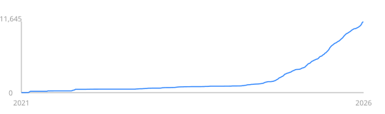
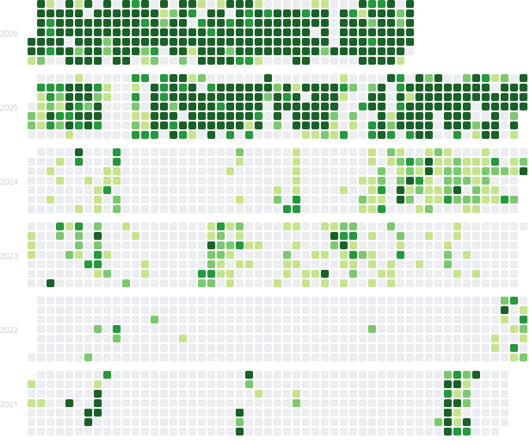

# Hi there, I'm Pragash Mohanarajah 👋

### Full-Stack, Forward Deployed & AI Researcher
Building and shipping high-performance systems at the intersection of **Deep Learning**, **Production Multimodal AI Systems**, **Scalable Web Architecture**, **Enterprise FinTech Platforms** and **Product Design**.

---

## ⚡ Quick Bio

I architect intelligent web applications that bridge the gap between complex data and intuitive user experiences. My work ranges from restoring ancient history through Multi-modal Vision-Language (VL) OCR to building real-time FinTech pipelines. I specialize in end-to-end systems that combine deep learning research with scalable cloud architecture.

I bridge the gap between cutting-edge AI models and real-world client environments. As a Forward Deployed AI Engineer, I specialize in architecting production-grade RAG pipelines, deploying custom data ingestion suites into legacy enterprise workflows, and building high-performance web applications.

* **🔭 Current Focus:** Multi-modal Legal AI Inference (Vertex AI / Gemini / Claude), Edge Document Processing, and High-Throughput RAG Systems.
* **🔭 Current Focus:** Multi-modal VL OCR for ancient text restoration, Scalable Data Pipelines & Optimizing Chess Engine intuition models.
* **🌱 Learning:** Advanced ONNX optimization, AWS Lambda for inference scaling, and fine-tuning Vision-Language Models (VLMs).
* **💼 Business Impact:** Monitored & processed **10,000+ case files** across 4 law firms, slashing audit times by 90% and saving 90% in operational costs.
* **💬 Ask me about:** Forward Deployed AI, Next.js/TypeScript, PyTorch, GCP/Vertex AI, Chess Theory or FinTech/Litigation Funding infrastructure.

---

## 🛠 Tech Stack

| Category | Tools & Technologies |
| :--- | :--- |
| **AI & LLM Infra** | Google Vertex AI (Gemini Pro/Vision), Anthropic Claude API, Multimodal RAG, PyTorch, ONNX |
| **Data & Systems** | Python (OS Optimization, PyInstaller), Pandas, Data Ingestion Pipelines, Local File Processing |
| **UI & Styling** | Tailwind CSS, HeroUI, Shadcn UI, Lucide React, Framer Motion |
| **Frontend** | Next.js, React, TypeScript, PHP |
| **Backend & Cloud** | GCP (Batch / On-Demand), Vercel Pro (Serverless), Node.js, Flask (Python), NGINX, Laravel |
| **Databases** | PostgreSQL, Supabase, MongoDB |
| **DevOps & Tools** | AWS (S3/EC2), Vercel, Docker Compose, GitHub Actions, CLI Tooling |
| **Systems & Hardware** | C, C++, VHDL, Arduino, Raspberry Pi |

---

## 🚀 Key Production & Enterprise Projects

### ⚖️ Legal AI & Multimodal RAG Pipeline (Production Deployment)
* **Forward Deployed AI System:** Architected an end-to-end legal inference engine running **Gemini Pro** and **Claude** models on GCP, routing requests via hybrid On-Demand and Batch APIs to optimize latency and compute cost.
* **Client Integration:** Deployed custom Python desktop/CLI document converters across **4 external law firms**, interfacing directly with legacy Legal CMS platforms (**Proclaim** and **CaseCube**).
* **Quantified Impact:** Monitored and successfully converted **10,000+ legal cases** (20+ file formats to PDF with automated Google Drive sync), reducing case processing time to an average of **10 minutes** per file.

### 💼 Enterprise Operations & Investor Platform
* **Full-Stack Architecture:** Built a central operational mission control and investor-facing platform using **Next.js, React, TypeScript, and Supabase (PostgreSQL)**.
* **Long-Running Serverless Compute:** Engineered backend API routes on **Vercel Pro** optimized for long-running execution (up to 800s) to handle complex financial calculations without timeouts.
* **Global Compliance & Automation:** Programmed automated investor communication engines for **10,000+ users** via Mailchimp APIs and built custom UK Holdings tax-statement generator logic for **500+ investors across 40+ countries**.

### 💸 FinTech & Systems Engineering (AxiaFunder)
* **Data Pipelines:** Architected real-time investment dashboards and robust automated CSV/data ingestion workflows for litigation funding using **Node.js, PostgreSQL, and Next.js**.

---

## 🧠 Selected Research & Innovation Projects

* **Ancient Text Restoration (UATRIAL):** Developed models using Deep Learning and Multi-modal Vision-Language (VL) techniques to restore and attribute ancient epigraphy, merging history with state-of-the-art NLP.
* **Neural Chess Engines:** Training models on FEN/PGN datasets to predict moves, served via Flask APIs to custom Next.js frontends. Experimenting with Stockfish fine-tuning and custom evaluation functions.
* **AI File Converter:** Built an end-to-end application that converts various file formats into standardized PDFs, enabling seamless RAG-based inference for AI models.
* **AxiaFunder Dashboard:** Architected real-time investment dashboards and robust CSV ingestion pipelines for litigation funding using Node.js and PostgreSQL.
* **Hack Cambridge Platform:** Maintained critical administration and operational platforms for one of the UK’s premier hackathons.
---

## 💡 Engineering Philosophy

> *"Build systems that are interactive, intelligent, and scalable. Prioritize clean architecture over quick hacks, and use AI to simplify — not complicate — the user experience."*

---

## 🤝 Let's Connect

I’m always open to collaborating on intelligent systems, web platforms, or anything chess-related.

* 🌍 **Portfolio:** [Visit my site](https://portfolio-pragash-mohanarajahs-projects.vercel.app/)
* 💼 **LinkedIn:** [linkedin.com/in/pragash-mohanarajah](https://www.linkedin.com/in/pragash-mohanarajah/)

---

<!-- DEV_METRICS_START -->
## 📊 Development Metrics

### 🐱 GitHub Overview
- 🔥 Current Streak: 9 days
- 🏆 Longest Streak: 28 days
- ✨ Total Commits: 11,327
- 💖 Commit Breakdown: 562 public (5.0%), 10,765 private (95.0%) · 7,183 owned (63.4%), 4,144 contributed (36.6%)
- 🚀 Repositories: 97 (35 public (36.1%), 62 private (63.9%))
- 👤 Ownership: 88 owned (90.7%), 9 contributed-to (9.3%)
- ⭐ Stars: 39 · 👀 Watchers: 39 · 🍴 Forks: 18 · 🗄️ Archived: 21
- 🧠 Estimated Lines of Code: 1,910,260
- 🤝 Followers: 3 · Following: 11
- 📅 Account age: 2,093 days

### 📝 Lines of Code by Language
```
C                    █████████                  35.28% (673,946 LOC)
Python               ████                       14.43% (275,619 LOC)
TypeScript           ███                        13.71% (261,896 LOC)
Jupyter Notebook     ███                        11.49% (219,406 LOC)
JavaScript           ██                          6.33% (120,928 LOC)
HTML                 █                           5.98% (114,156 LOC)
Makefile             █                           3.25% (62,016 LOC)
Roff                 █                           2.83% (54,070 LOC)
```

### 📚 Top Languages (by Repo Count)
```
JavaScript           █████                      18.07% (45 repos)
Python               ████                       15.66% (39 repos)
CSS                  ███                        12.45% (31 repos)
TypeScript           ███                        10.04% (25 repos)
HTML                 ██                          8.43% (21 repos)
Shell                ██                          7.23% (18 repos)
Jupyter Notebook     █                           5.22% (13 repos)
Dockerfile           █                           4.42% (11 repos)
```

### 💾 Languages by Code Size (Bytes)
```
C                    █████████                  35.28% (33,697,286 bytes)
Python               ████                       14.43% (13,780,927 bytes)
TypeScript           ███                        13.71% (13,094,839 bytes)
Jupyter Notebook     ███                        11.49% (10,970,311 bytes)
JavaScript           ██                          6.33% (6,046,382 bytes)
HTML                 █                           5.98% (5,707,816 bytes)
```

### 🧩 Project Categories (by Repo Count)
```
Other                ███████████████            61.86% (60 repos)
AI / ML              █████                      20.62% (20 repos)
Web Apps             ███                        11.34% (11 repos)
Data Systems         ██                          6.19% (6 repos)
```

### 🧮 Project Categories (by Estimated LOC)
```
AI / ML              ████████████████           62.78% (1,199,284 LOC)
Other                ███████                    28.44% (543,310 LOC)
Web Apps             ██                          6.98% (133,289 LOC)
Data Systems                                     1.80% (34,377 LOC)
```

### 🏷️ Top Topics
```
JavaScript           ████████████               46.39% (45 repos)
Python               ██████████                 40.21% (39 repos)
CSS                  ████████                   31.96% (31 repos)
TypeScript           ██████                     25.77% (25 repos)
HTML                 █████                      21.65% (21 repos)
Shell                █████                      18.56% (18 repos)
Jupyter Notebook     ███                        13.40% (13 repos)
Dockerfile           ███                        11.34% (11 repos)
Batchfile            ██                          6.19% (6 repos)
C++                  █                           5.15% (5 repos)
```

### 🚀 Top Owned Projects
- Pragash-Mohanarajah/dashboard-axiafunder — AxiaFunder Internal Dashboard Application built with Next.js and Vercel (Fork... _(Web Apps · 2005 commits · private)_
- Pragash-Mohanarajah/ai-hdr-inference — AI HDR Case Reviewer Software for Inference from large PDF files _(AI / ML · 924 commits · private)_
- Pragash-Mohanarajah/exambank-ai-frontend — Exambank AI - Frontend Code Repository (forked from AlphaFactory/exambank-fro... _(AI / ML · 474 commits · private)_
- Pragash-Mohanarajah/ai-hdr-file-converter — Desktop File Converter Application: Local Conversion of Supported Files to PD... _(AI / ML · 472 commits · private)_
- Pragash-Mohanarajah/axia-lm-optimizer — Convert to PDF _(Other · 458 commits · private)_

### 🤝 Top Contributed Projects
- AxiaFunder/dashboard-axiafunder _(Other · 2173 commits · private)_
- AxiaFunder/ai-hdr-core — Split from ai-hdr-inference _(AI / ML · 622 commits · private)_
- AxiaFunder/ai-hdr-provider-prompts — Split from ai-hdr-inference _(AI / ML · 123 commits · private)_
- AxiaFunder/axiafunder — Monorepo for Axiafunder Applications _(Other · 55 commits · private)_
- AxiaFunder/ai-hdr-provider-sdk — Split from ai-hdr-inference _(AI / ML · 43 commits · private)_

### 📅 Productivity by Time of Day
```
Night (00-06)                                    0.56% (23 commits)
Morning (06-12)      ██████████████             56.50% (2,307 commits)
Afternoon (12-18)    ████████                   30.71% (1,254 commits)
Evening (18-24)      ███                        12.22% (499 commits)
```

### 📅 Productivity by Day
```
Sunday               ██                          7.87% (929 contributions)
Monday               ███                        13.58% (1,602 contributions)
Tuesday              █████                      18.14% (2,140 contributions)
Wednesday            █████                      19.32% (2,279 contributions)
Thursday             ████                       17.10% (2,018 contributions)
Friday               ████                       17.03% (2,009 contributions)
Saturday             ██                          6.97% (822 contributions)
```

### 📦 Most Active Repositories
```
AxiaFunder/dashboard-axiafunder                                             █████                      19.18% (2,173 commits)
Pragash-Mohanarajah/dashboard-axiafunder                                    ████                       17.70% (2,005 commits)
Pragash-Mohanarajah/ai-hdr-inference                                        ██                          8.16% (924 commits)
AxiaFunder/ai-hdr-core                                                      █                           5.49% (622 commits)
Pragash-Mohanarajah/exambank-ai-frontend                                    █                           4.18% (474 commits)
Pragash-Mohanarajah/ai-hdr-file-converter                                   █                           4.17% (472 commits)
Pragash-Mohanarajah/axia-lm-optimizer                                       █                           4.04% (458 commits)
```

### ⚡ Recent Activity
- Pragash-Mohanarajah/human-language-evolution — feat: Phase 2 Step 2c second stand-in result: Early-Brahmi letters (BrahmiGAN) identified 49.1% (DINOv2) and 47.0% (Qwen tower) against the declared 80%; recorded as a failure (D207)
- Pragash-Mohanarajah/human-language-evolution — docs: D207 Phase 2 Step 2c second stand-in: labelled Early-Brahmi letters (BrahmiGAN), preregistration (declared before any run)
- Pragash-Mohanarajah/human-language-evolution — feat: BrahmiGAN stand-in for Step 2c: label mapping to Unicode Brahmi letters, seeded sampling, normalisation, brahmigan-check command (D207)
- Pragash-Mohanarajah/human-language-evolution — refactor: nearest-reference identification moved to its own module so every labelled set shares it; per-sample kinds are passed in (D206)
- AxiaFunder/axiafunder — Merge pull request #78 from AxiaFunder/db/phase-3-1c-deprecate-tax-statement-template
- AxiaFunder/axiafunder — Merge branch 'main' into db/phase-3-1c-deprecate-tax-statement-template
- AxiaFunder/axiafunder — Merge pull request #77 from AxiaFunder/db/phase-3-1a-template-table-create
- AxiaFunder/axiafunder — Phase 3.1c: rename tax_statement_template to _deprecated_tax_statement_template
- AxiaFunder/axiafunder — Phase 3.1a: create template table and backfill tax_statement_template
- Pragash-Mohanarajah/human-language-evolution — feat: Phase 2 Step 2c stand-in result: neither embedder identifies handwritten Tamil characters (Qwen tower 13.4%, DINOv2 1.9% top-1 against the declared 80%); recorded as a failure (D206)
- AxiaFunder/dashboard-axiafunder — Merge pull request #291 from AxiaFunder/develop
- AxiaFunder/dashboard-axiafunder — Merge branch 'main' into develop
- AxiaFunder/dashboard-axiafunder — Merge pull request #290 from AxiaFunder/fix/job-status-retry-logging
- AxiaFunder/dashboard-axiafunder — Log each retry attempt's error in fetchReportJobStatuses
- AxiaFunder/dashboard-axiafunder — Merge pull request #289 from AxiaFunder/db/phase-2-8-job-run-status-restructure

### 🌟 Recent Stars
- unoconv/unoserver
- moodle/moodle
- n15hsy/axia-lm

### 📈 All-Time Commit History


### 📅 Contribution Graph


_Last updated on Tue, 06 Oct 2026 17:37:25 GMT_
<!-- DEV_METRICS_END -->
