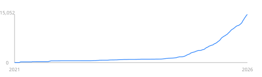
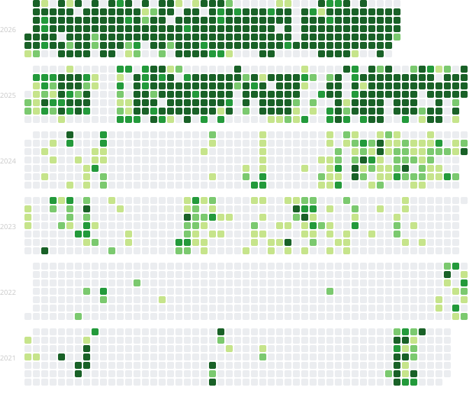

# Hi there, I'm Pragash Mohanarajah 👋

### Full-Stack, Forward Deployed & AI Researcher
Building and shipping high-performance systems at the intersection of **Deep Learning**, **Production Multimodal AI Systems**, **Scalable Web Architecture**, **Enterprise FinTech Platforms** and **Product Design**.

---

## ⚡ Quick Bio

I architect intelligent web applications that bridge the gap between complex data and intuitive user experiences. My work ranges from restoring ancient history through Multi-modal Vision-Language (VL) OCR to building real-time FinTech pipelines. I specialize in end-to-end systems that combine deep learning research with scalable cloud architecture.

I bridge the gap between cutting-edge AI models and real-world client environments. As a Forward Deployed AI Engineer, I specialize in architecting production-grade RAG pipelines, deploying custom data ingestion suites into legacy enterprise workflows, and building high-performance web applications.

* **🔭 Current Focus:** Multi-modal Legal AI Inference (Vertex AI / Gemini / Claude), Edge Document Processing, and High-Throughput RAG Systems.
* **🔭 Current Focus:** Multi-modal VL OCR for ancient text restoration, Scalable Data Pipelines & Optimizing Chess Engine intuition models.
* **🌱 Learning:** Advanced ONNX optimization, AWS Lambda for inference scaling, and fine-tuning Vision-Language Models (VLMs).
* **💼 Business Impact:** Monitored & processed **10,000+ case files** across 4 law firms, slashing audit times by 90% and saving 90% in operational costs.
* **💬 Ask me about:** Forward Deployed AI, Next.js/TypeScript, PyTorch, GCP/Vertex AI, Chess Theory or FinTech/Litigation Funding infrastructure.

---

## 🛠 Tech Stack

| Category | Tools & Technologies |
| :--- | :--- |
| **AI & LLM Infra** | Google Vertex AI (Gemini Pro/Vision), Anthropic Claude API, Multimodal RAG, PyTorch, ONNX |
| **Data & Systems** | Python (OS Optimization, PyInstaller), Pandas, Data Ingestion Pipelines, Local File Processing |
| **UI & Styling** | Tailwind CSS, HeroUI, Shadcn UI, Lucide React, Framer Motion |
| **Frontend** | Next.js, React, TypeScript, PHP |
| **Backend & Cloud** | GCP (Batch / On-Demand), Vercel Pro (Serverless), Node.js, Flask (Python), NGINX, Laravel |
| **Databases** | PostgreSQL, Supabase, MongoDB |
| **DevOps & Tools** | AWS (S3/EC2), Vercel, Docker Compose, GitHub Actions, CLI Tooling |
| **Systems & Hardware** | C, C++, VHDL, Arduino, Raspberry Pi |

---

## 🚀 Key Production & Enterprise Projects

### ⚖️ Legal AI & Multimodal RAG Pipeline (Production Deployment)
* **Forward Deployed AI System:** Architected an end-to-end legal inference engine running **Gemini Pro** and **Claude** models on GCP, routing requests via hybrid On-Demand and Batch APIs to optimize latency and compute cost.
* **Client Integration:** Deployed custom Python desktop/CLI document converters across **4 external law firms**, interfacing directly with legacy Legal CMS platforms (**Proclaim** and **CaseCube**).
* **Quantified Impact:** Monitored and successfully converted **10,000+ legal cases** (20+ file formats to PDF with automated Google Drive sync), reducing case processing time to an average of **10 minutes** per file.

### 💼 Enterprise Operations & Investor Platform
* **Full-Stack Architecture:** Built a central operational mission control and investor-facing platform using **Next.js, React, TypeScript, and Supabase (PostgreSQL)**.
* **Long-Running Serverless Compute:** Engineered backend API routes on **Vercel Pro** optimized for long-running execution (up to 800s) to handle complex financial calculations without timeouts.
* **Global Compliance & Automation:** Programmed automated investor communication engines for **10,000+ users** via Mailchimp APIs and built custom UK Holdings tax-statement generator logic for **500+ investors across 40+ countries**.

### 💸 FinTech & Systems Engineering (AxiaFunder)
* **Data Pipelines:** Architected real-time investment dashboards and robust automated CSV/data ingestion workflows for litigation funding using **Node.js, PostgreSQL, and Next.js**.

---

## 🧠 Selected Research & Innovation Projects

* **Ancient Text Restoration (UATRIAL):** Developed models using Deep Learning and Multi-modal Vision-Language (VL) techniques to restore and attribute ancient epigraphy, merging history with state-of-the-art NLP.
* **Neural Chess Engines:** Training models on FEN/PGN datasets to predict moves, served via Flask APIs to custom Next.js frontends. Experimenting with Stockfish fine-tuning and custom evaluation functions.
* **AI File Converter:** Built an end-to-end application that converts various file formats into standardized PDFs, enabling seamless RAG-based inference for AI models.
* **AxiaFunder Dashboard:** Architected real-time investment dashboards and robust CSV ingestion pipelines for litigation funding using Node.js and PostgreSQL.
* **Hack Cambridge Platform:** Maintained critical administration and operational platforms for one of the UK’s premier hackathons.
---

## 💡 Engineering Philosophy

> *"Build systems that are interactive, intelligent, and scalable. Prioritize clean architecture over quick hacks, and use AI to simplify — not complicate — the user experience."*

---

## 🤝 Let's Connect

I’m always open to collaborating on intelligent systems, web platforms, or anything chess-related.

* 🌍 **Portfolio:** [Visit my site](https://portfolio-pragash-mohanarajahs-projects.vercel.app/)
* 💼 **LinkedIn:** [linkedin.com/in/pragash-mohanarajah](https://www.linkedin.com/in/pragash-mohanarajah/)

---

<!-- DEV_METRICS_START -->
## 📊 Development Metrics

### 🐱 GitHub Overview
- 🔥 Current Streak: 2 days
- 🏆 Longest Streak: 28 days
- ✨ Total Commits: 14,391
- 💖 Commit Breakdown: 562 public (3.9%), 13,829 private (96.1%) · 8,248 owned (57.3%), 6,143 contributed (42.7%)
- 🚀 Repositories: 100 (35 public (35.0%), 65 private (65.0%))
- 👤 Ownership: 89 owned (89.0%), 11 contributed-to (11.0%)
- ⭐ Stars: 39 · 👀 Watchers: 39 · 🍴 Forks: 18 · 🗄️ Archived: 21
- 🧠 Estimated Lines of Code: 2,099,968
- 🤝 Followers: 2 · Following: 11
- 📅 Account age: 2,122 days

### 📝 Lines of Code by Language
```
C                    ████████                   32.09% (673,946 LOC)
Python               █████                      20.06% (421,210 LOC)
TypeScript           ███                        13.61% (285,734 LOC)
Jupyter Notebook     ███                        10.53% (221,042 LOC)
JavaScript           ██                          6.40% (134,392 LOC)
HTML                 █                           5.44% (114,206 LOC)
Makefile             █                           2.95% (62,016 LOC)
Roff                 █                           2.57% (54,070 LOC)
```

### 📚 Top Languages (by Repo Count)
```
JavaScript           ████                       17.29% (46 repos)
Python               ████                       15.41% (41 repos)
CSS                  ███                        12.03% (32 repos)
TypeScript           ██                          9.77% (26 repos)
Shell                ██                          7.89% (21 repos)
HTML                 ██                          7.89% (21 repos)
Dockerfile           █                           5.64% (15 repos)
Jupyter Notebook     █                           5.26% (14 repos)
```

### 💾 Languages by Code Size (Bytes)
```
C                    ████████                   32.09% (33,697,286 bytes)
Python               █████                      20.06% (21,060,364 bytes)
TypeScript           ███                        13.61% (14,286,754 bytes)
Jupyter Notebook     ███                        10.53% (11,052,126 bytes)
JavaScript           ██                          6.40% (6,719,629 bytes)
HTML                 █                           5.44% (5,710,356 bytes)
```

### 🧩 Project Categories (by Repo Count)
```
Other                ███████████████            60.00% (60 repos)
AI / ML              ██████                     23.00% (23 repos)
Web Apps             ███                        11.00% (11 repos)
Data Systems         ██                          6.00% (6 repos)
```

### 🧮 Project Categories (by Estimated LOC)
```
AI / ML              ████████████████           64.74% (1,359,575 LOC)
Other                ███████                    26.99% (566,865 LOC)
Web Apps             ██                          6.63% (139,151 LOC)
Data Systems                                     1.64% (34,377 LOC)
```

### 🏷️ Top Topics
```
JavaScript           ████████████               46.00% (46 repos)
Python               ██████████                 41.00% (41 repos)
CSS                  ████████                   32.00% (32 repos)
TypeScript           ███████                    26.00% (26 repos)
Shell                █████                      21.00% (21 repos)
HTML                 █████                      21.00% (21 repos)
Dockerfile           ████                       15.00% (15 repos)
Jupyter Notebook     ████                       14.00% (14 repos)
Batchfile            ██                          8.00% (8 repos)
C++                  █                           5.00% (5 repos)
```

### 🚀 Top Owned Projects
- Pragash-Mohanarajah/dashboard-axiafunder — AxiaFunder Internal Dashboard Application built with Next.js and Vercel (Fork... _(Web Apps · 2337 commits · private)_
- Pragash-Mohanarajah/ai-hdr-inference — AI HDR Case Reviewer Software for Inference from large PDF files _(AI / ML · 1136 commits · private)_
- Pragash-Mohanarajah/ai-hdr-file-converter — Desktop File Converter Application: Local Conversion of Supported Files to PD... _(AI / ML · 578 commits · private)_
- Pragash-Mohanarajah/axia-lm-optimizer — Convert to PDF _(Other · 564 commits · private)_
- Pragash-Mohanarajah/exambank-ai-frontend — Exambank AI - Frontend Code Repository (forked from AlphaFactory/exambank-fro... _(AI / ML · 474 commits · private)_

### 🤝 Top Contributed Projects
- AxiaFunder/dashboard-axiafunder _(Other · 2338 commits · private)_
- AxiaFunder/ai-hdr-inference — AI HDR Case Reviewer Software for Inference from large PDF files _(AI / ML · 1187 commits · private)_
- AxiaFunder/ai-hdr-core — Split from ai-hdr-inference _(AI / ML · 629 commits · private)_
- AxiaFunder/ai-hdr-conversion — File Converter Application: Conversion of Supported Files to PDF (Built with ... _(AI / ML · 579 commits · private)_
- AxiaFunder/ai-hdr-provider-prompts — Split from ai-hdr-inference _(AI / ML · 125 commits · private)_

### 📅 Productivity by Time of Day
```
Night (00-06)                                    0.42% (20 commits)
Morning (06-12)      ██████████████             57.89% (2,761 commits)
Afternoon (12-18)    ████████                   30.70% (1,464 commits)
Evening (18-24)      ███                        10.99% (524 commits)
```

### 📅 Productivity by Day
```
Sunday               ██                          6.25% (934 contributions)
Monday               ███                        13.96% (2,088 contributions)
Tuesday              ████                       17.85% (2,670 contributions)
Wednesday            █████                      19.76% (2,955 contributions)
Thursday             █████                      18.14% (2,713 contributions)
Friday               █████                      18.18% (2,719 contributions)
Saturday             █                           5.85% (875 contributions)
```

### 📦 Most Active Repositories
```
AxiaFunder/dashboard-axiafunder                                             ████                       16.25% (2,338 commits)
Pragash-Mohanarajah/dashboard-axiafunder                                    ████                       16.24% (2,337 commits)
AxiaFunder/ai-hdr-inference                                                 ██                          8.25% (1,187 commits)
Pragash-Mohanarajah/ai-hdr-inference                                        ██                          7.89% (1,136 commits)
AxiaFunder/ai-hdr-core                                                      █                           4.37% (629 commits)
AxiaFunder/ai-hdr-conversion                                                █                           4.02% (579 commits)
Pragash-Mohanarajah/ai-hdr-file-converter                                   █                           4.02% (578 commits)
```

### ⚡ Recent Activity
- Pragash-Mohanarajah/human-language-evolution — docs: Session 33 close with E42 still running and the resume steps (D269)
- Pragash-Mohanarajah/human-language-evolution — feat: the cross-fitted fine-tunes can run on the GPU, about 7 times faster per step (D269)
- AxiaFunder/ai-hdr-inference — docs: v4.12 changelog, ledger columns and the consolidated tab
- Pragash-Mohanarajah/ai-hdr-inference — docs: v4.12 changelog, ledger columns and the consolidated tab
- AxiaFunder/ai-hdr-inference — fix: show each ledger stage in the report's key: value | key: value shape
- Pragash-Mohanarajah/ai-hdr-inference — fix: show each ledger stage in the report's key: value | key: value shape
- AxiaFunder/ai-hdr-inference — feat: one report column per ledger stage, and neglected above stalled in case_status
- Pragash-Mohanarajah/ai-hdr-inference — feat: one report column per ledger stage, and neglected above stalled in case_status
- AxiaFunder/ai-hdr-inference — feat: a consolidated tab with case_status for every workflow's report
- Pragash-Mohanarajah/ai-hdr-inference — feat: a consolidated tab with case_status for every workflow's report
- Pragash-Mohanarajah/dashboard-axiafunder — Merge pull request #347 from AxiaFunder/develop
- AxiaFunder/dashboard-axiafunder — Merge pull request #347 from AxiaFunder/develop
- Pragash-Mohanarajah/dashboard-axiafunder — feat: add a colour key to the top of the trustee invoice sheet
- AxiaFunder/dashboard-axiafunder — feat: add a colour key to the top of the trustee invoice sheet
- Pragash-Mohanarajah/dashboard-axiafunder — fix: include the quarter in the trustee invoice already-saved check

### 🌟 Recent Stars
- unoconv/unoserver
- moodle/moodle
- n15hsy/axia-lm

### 📈 All-Time Commit History


### 📅 Contribution Graph


_Last updated on Wed, 04 Nov 2026 03:55:01 GMT_
<!-- DEV_METRICS_END -->
